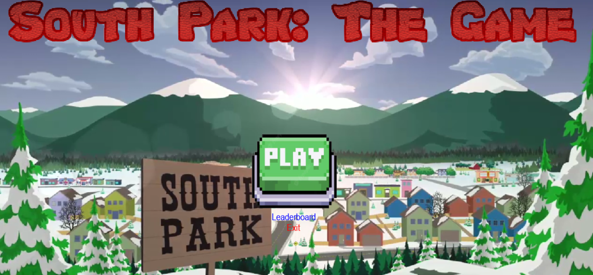
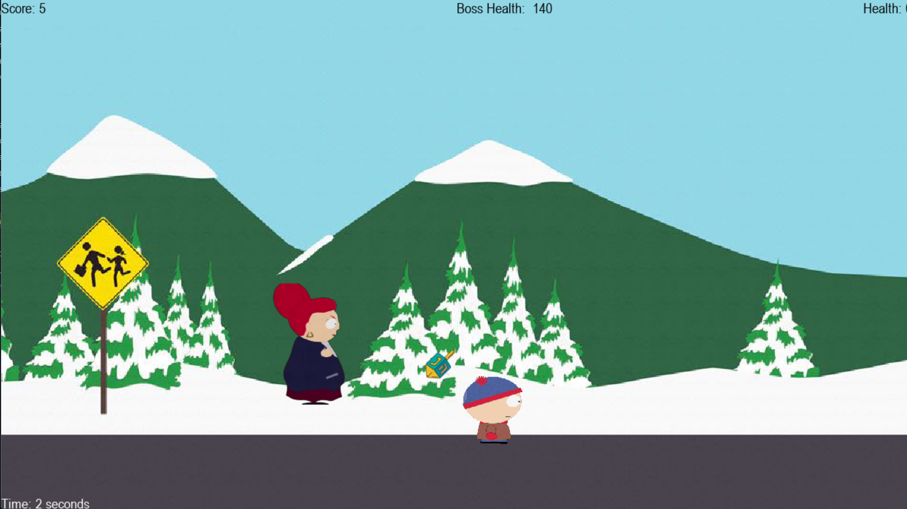
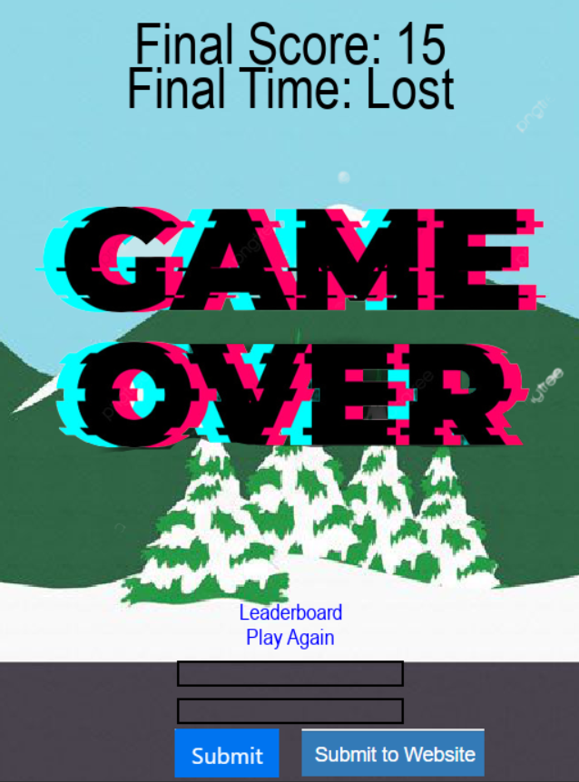
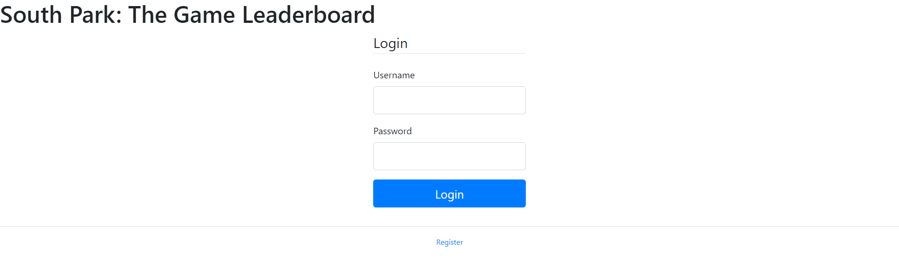
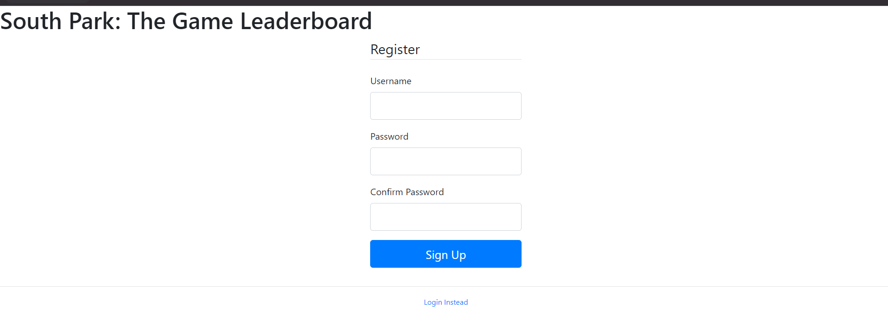
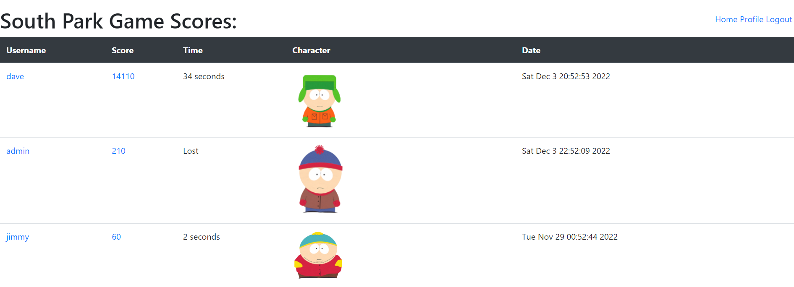
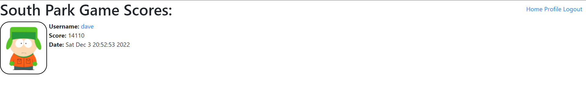
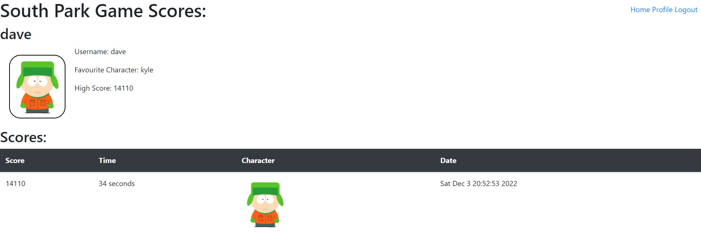
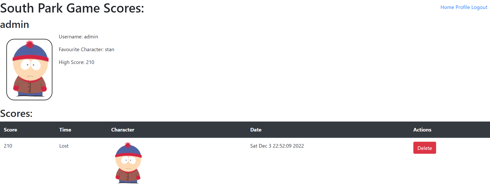

# South_park_game

By Brandon Woo 

## Visit the leaderboard

http://143.198.226.171:5000/

(The site is very unstable and very slow so it might not load on the first try lol)

**NOTE: all leaderboard buttons in the game take you to the DigitalOcean website, to see the local server, you will have to start `app.py` and go to http://localhost:5000**

## Controls
- `A` and `D` to move left and right respectively
- `SPACE` to jump
- `LEFT CLICK` to shoot a projectile in the direction of your curser

## Installation

- After cloning this repository, you will need to setup a python virtual environment, you will need to install **Pygame, Flask, flask-wtf, requests**
- Activate the virtual environment
- **You must be inside of the South_Park_Game directory to run this code**
- If you wish to submit scores locally, you will have to turn the server on by running the `app.py` module. This will launch the Flask Server. Otherwise you can submit scores to the website after the game ends
- To run the game run `python game.py`

## How to play:
1. After running the game, you will be presented with the main screen. You can start the game, visit the leaderboard, or exit the game.

2. After pressing play, you will be presented with the character select screen. Choose a character by clicking on one.

3. You will be taken to the game screen. In the game there are 3 bosses to fight. Each boss has different strengths. The first boss, Kyle's mom, is the base boss. The second boss, snooki, has less health but can move faster. The third boss, satan, has the most health but is much slower. The current boss will randomly shoot bosses towards the player's location. To defeat the boss, move your character with the `A` and `D` key to move left and right respectively. You can shoot the boss by left clicking and a projectile will shoot towards your cursor's location. There is a cooldown of one second for the player shooting.

4. The game will end after you either, die, defeat all of the bosses. On the game over screen, you have the option to play again, view the leaderboard, and submit your score to the website. If you won the game, your score will be multiplied by the time you were alive. **Therefore, the game rewards you for lasting as long as possible**. You will need to have an account inside of the database to access the scores. You can make one for the local server at http://localhost:5000/register or on the website at http://143.198.226.171/register
To submit your score you will have to click the box, and type in your username into the first box and your password into the second box, then click submit on the button for the server you wish to post to. Your time and score will be submitted.

>If your username or password is wrong, the text will be cleared and error will be written on the screen. You can resubmit your credentials. If your post was successful you will not be able to post again
5. To view scores, you can visit the website or localhost and login. You can view scores from all players who have submitted scores

## The Website
- Upon going to the website http://127.0.0.1:5000/ or http://143.198.226.171:5000/, this will bring you to the login page where you will have to login to view the next pages of the website.

>There is a user made for you called with the Username: `tim` and the password: `tim` if you don't want to make an account

- You can make an account by clicking the register link which will take you to the register page

- After registering or logging in, you will be able to view the scoreboard

> The leaderboard is sorted by score. If you won the game, your time will also be posted. 
- From here you can view more score details

- You can also view a user's profile

- If you're viewing your own profile, you can also delete your scores from the database

## Code Structure
The Game consists of the following files:
- `/components`
- `/screens`
- `/images`
- `global_variables.py`
- `game.py` 

The Flask Application consists of the following files:
- `/forms`
- `/data`
- `/models`
- `/static`
- `/templates`
- `app.py`
